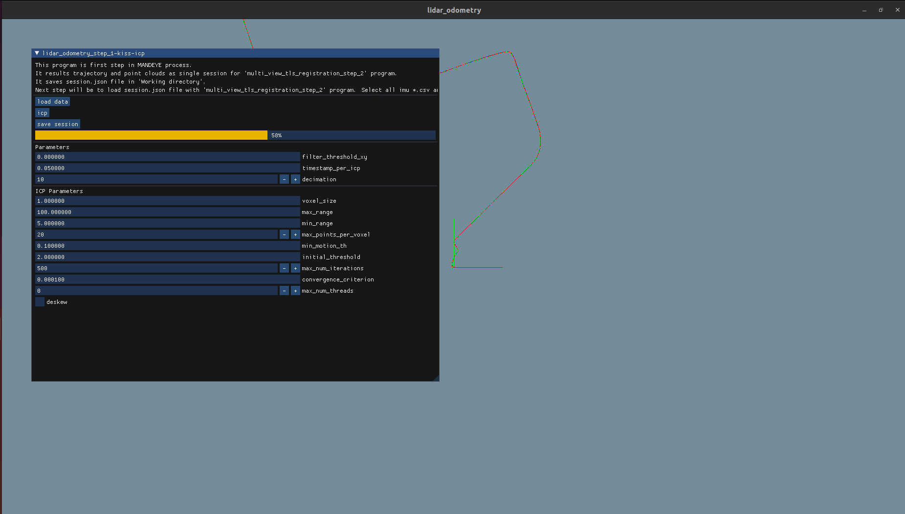

# Lidar odometry for HDMapping project utilizing KISS-ICP.

This software provides an alternative approach to Lidar odometry in [MapsHD/HDMapping](https://github.com/MapsHD/HDMapping).
It uses the same data structures and interfaces as the original implementation, but replaces the ICP algorithm with the KISS-ICP algorithm.
KISS-ICP is available in the [PRBonn/ICP](https://github.com/PRBonn/kiss-icp) repository.

## Usage

Click 'Load data' button and select `imu***.csv` and `lidar***.csv` files from the dataset.
Dataset can be obtained with the [JanuszBedkowski/mandeye_controller](https://github.com/JanuszBedkowski/mandeye_controller) project,
or downloaded from [here](https://michalpelka.github.io/RosCon2024_workshop/).

 Next click 'ICP' button to start the odometry process.
 
Finally, click 'Save session' the session.
The session can be processed with the MapsHD/HDMapping software.

## Parameters

Refer to the [PRBonn/ICP](https://github.com/PRBonn/kiss-icp/blob/07c893b2489106ad1b412d6d653aa95792a7c173/config/advanced.yaml) repository for the list of parameters.