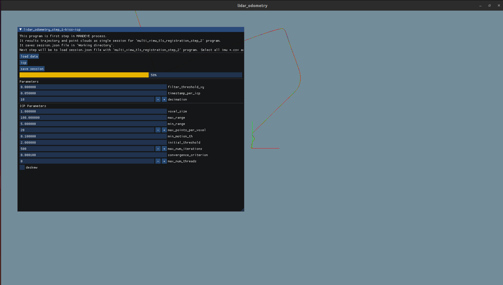

# Lidar odometry for HDMapping project utilizing KISS-ICP.

[](https://github.com/michalpelka/kiss-lidarodometry/actions/workflows/linux.yml)
[](https://github.com/michalpelka/kiss-lidarodometry/actions/workflows/windows.yml)

This software provides an alternative approach to Lidar odometry in [MapsHD/HDMapping](https://github.com/MapsHD/HDMapping).
It uses the same data structures and interfaces as the original implementation, but replaces the ICP algorithm with the KISS-ICP algorithm.
KISS-ICP is available in the [PRBonn/ICP](https://github.com/PRBonn/kiss-icp) repository.

## Supported Data Formats
- **LAZ/LAS files**: Original MANDEYE sensor format
- **ROS 2 rosbags**: PointCloud2 messages (Linux only)

## Building

### Standard Build (LAZ support only)
```bash
mkdir build && cd build
cmake ..
make
```

### Linux Build with ROS 2 Support
```bash
mkdir build && cd build
cmake -DWITH_ROS2=ON ..
make
```

## Usage

### GUI Mode


#### LAZ/LAS Files
Click 'Load data' button and select `imu***.csv` and `lidar***.csv` files from the dataset.
Dataset can be obtained with the [JanuszBedkowski/mandeye_controller](https://github.com/JanuszBedkowski/mandeye_controller) project,
or downloaded from [here](https://michalpelka.github.io/RosCon2024_workshop/).

#### ROS 2 Rosbags (Linux only)
Click 'Load rosbag' button and select a rosbag directory containing PointCloud2 messages.

Next click 'ICP' button to start the odometry process.

Finally, click 'Save session' to save the session.
The session can be processed with the MapsHD/HDMapping software.

### Headless Mode

#### Process LAZ files
```bash
./kiss_icp_lidar_odometry --nogui --process /path/to/laz/files --resultName my_result
```

#### Process ROS 2 rosbag (Linux only)
```bash
./kiss_icp_lidar_odometry --nogui --rosbag /path/to/rosbag --resultName my_result
```

#### With configuration file
```bash
./kiss_icp_lidar_odometry --config params.json --nogui --rosbag /path/to/rosbag
```

## ROS 2 Integration Details

The ROS 2 rosbag support includes:
- Automatic detection of PointCloud2 topics in rosbags
- Support for various timestamp field formats (`t`, `timestamp`, `time`)
- Multi-LiDAR support with automatic ID assignment based on topic names
- Intensity extraction when available
- Time-based filtering options
- Maintains compatibility with existing calibration and processing pipeline

## Parameters

Refer to the [PRBonn/ICP](https://github.com/PRBonn/kiss-icp/blob/07c893b2489106ad1b412d6d653aa95792a7c173/config/advanced.yaml) repository for the list of parameters.